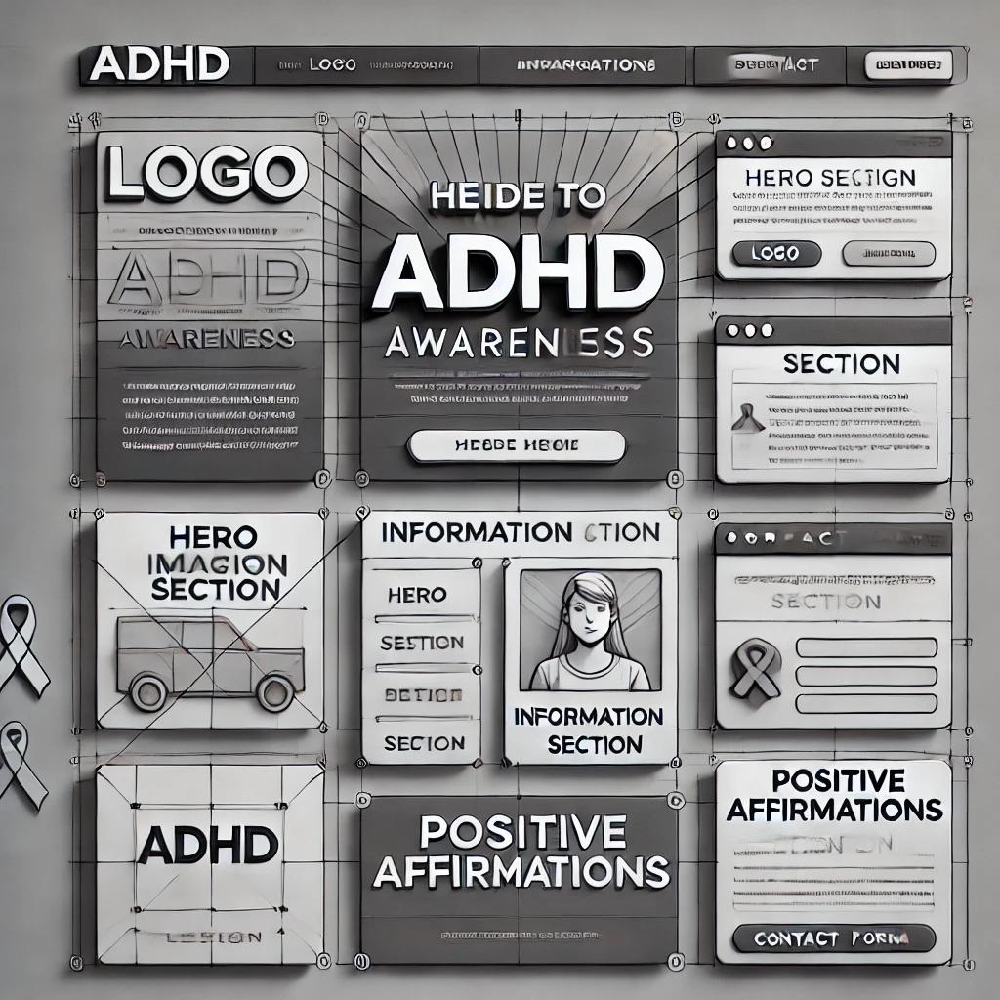
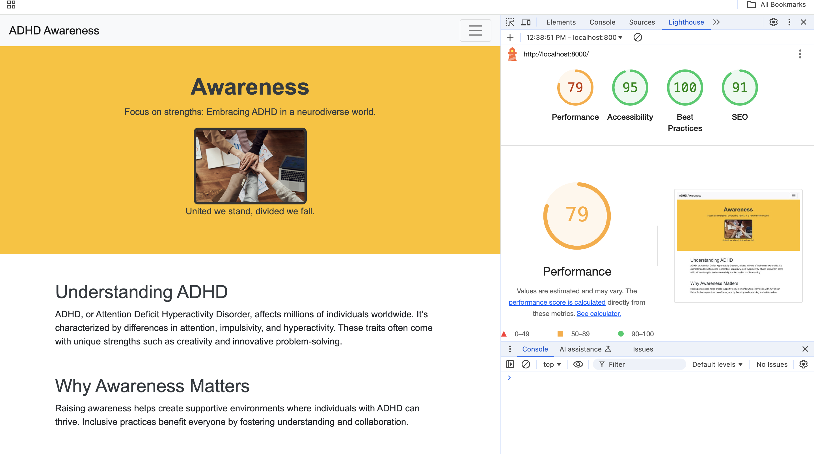

ADHD Awareness
Live Site Link
ADHD Awareness Website: https://mary1-commits.github.io/cli/

Brief Introduction:
The "ADHD Awareness" website is designed to educate users about Attention Deficit Hyperactivity Disorder (ADHD) through informative content, interactive features, and helpful resources. Its goal is to provide accessible and reliable information, support inclusivity, and encourage understanding of ADHD in diverse communities.

Responsivity:
The website is fully responsive, adapting seamlessly to desktop, tablet, and mobile devices. I used bootstrap to give me variations on the columns so that the design is responsive to all devices.

UX (User Experience)
User Stories
Must-Haves
As a user, I want to learn about ADHD and its symptoms so that I can better understand its impact.
As a user, I want access to a list of reputable ADHD resources so that I can find credible information and support.
As a user, I want the website to adapt to my device's screen size so that I can view it easily on desktop, tablet, or mobile.
As a user, I want a clear navigation menu so that I can find the content I’m looking for easily.
Should-Haves
As a user, I want to take a short quiz about ADHD so that I can test my knowledge or learn more about it.
As a user, I want to read uplifting quotes about ADHD so that I feel inspired and supported.
Could-Have
As a user, I want to watch ADHD-related videos so that I can learn visually about the condition.
Strategy
This project aims to spread awareness about ADHD by providing accurate information, fostering inclusivity, and offering educational resources in an engaging format.

Scope
The website includes:

Informational sections about ADHD.
External resource links.
Responsive design for accessibility.
Interactive quiz and motivational quotes.

Structural Design
The website is structured with a simple and intuitive navigation bar, leading users to dedicated sections for ADHD information, resources, and interactive features.

Skeleton (Wireframes)
Wireframes were created to guide the layout and design. Below are snapshots of the wireframes:
<<<<<<< HEAD

Surface Design
Typography
The website uses:
Headings: Lora (serif) for an elegant and professional look.
Body Text: Open Sans for readability.
Color Scheme and Imagery
Primary Colors: Blue (#4A90E2) for trust and calmness.
Accent Colors: Yellow (#F7C948) for optimism and positivity.
Imagery: Bright, inclusive visuals representing diverse individuals with ADHD.
Website Features
Tablet/Mobile View
The website uses a responsive grid layout with media queries to ensure usability on all devices.

Things that I would include in the future to imrpove my website is:
User-submitted testimonials.
Forum for discussions and peer support.
Newsletter subscription for ADHD-related updates.

Technologies that were used included:
Languages
HTML
CSS
JavaScript
Frameworks/Libraries
Bootstrap for responsiveness.
FontAwesome for icons.
Programs Figma for wireframes. 
Visual Studio Code for coding.

Deployment
To deploy the site on GitHub Pages:

Push your project to GitHub.
Go to the repository’s settings.
Under “Pages,” select the main branch and /root folder.
Click “Save.” Your website will be live at a provided URL.
Testing
Validation
HTML Validation: Passed W3C validation.
CSS Validation: Passed W3C validation.

Lighthouse Report

Bugs
Fixed: Navigation menu overlapping on smaller screens.
Known Issue: Quiz layout shifts slightly on very small screens (<320px).
Credits
Content References
ADHD educational content sourced from trusted organizations like CHADD and ADDitude.
ChatGPT
Assistance in generating the README and refining project features.

Media References
Images sourced from and Pexels.

<<<<<<< HEAD
=======

>>>>>>> b6008a7bfada0f000d1bbaedf6ed88120e19dac7

[def]: images/lighthouse-validation.png